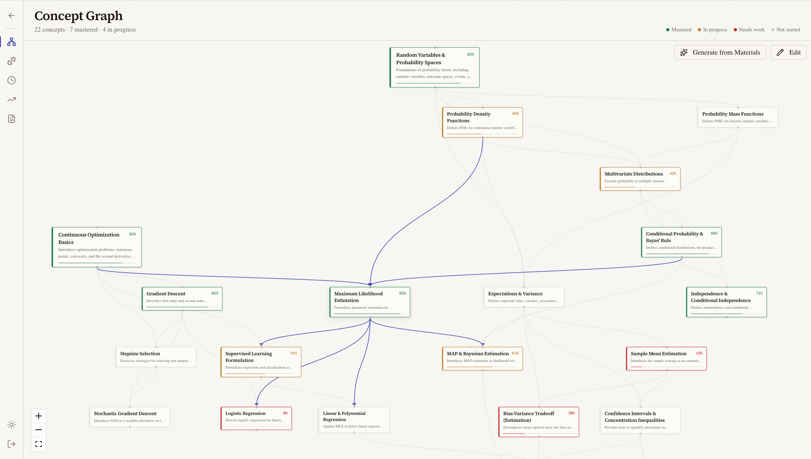

# Course Map

Self-directed study app for building interactive concept dependency graphs, uploading course materials, and practicing with AI-generated questions. Readiness scores track mastery per concept using a weighted blend of quiz performance and self-assessment.

**[Try it live](https://course-map-sigma.vercel.app/)**



## Features

- **Concept Graphs** — Interactive DAG visualization (React Flow + dagre) with view/edit modes. Generate concepts automatically from uploaded materials via AI, or add them manually. Prerequisite edges with server-side cycle detection.
- **Semantic Material Search** — Upload PDFs, text, or markdown. Materials are chunked and embedded via Supabase Edge Functions (`gte-small`, 384d). Click any concept node to see semantically matched materials with a built-in PDF viewer.
- **AI Practice Questions** — Select a concept, type (MC or free response), and difficulty. Questions are generated using RAG context from your materials. MC answers are verified by a second LLM call. Short answer questions support pdf upload. Answer, get AI feedback, self-assess, and watch your readiness update.
- **Readiness Tracking** — Per-concept mastery scores (EWMA quiz performance + self-assessment average). Progress page with SVG ring charts, per-concept bars, and actionable recommendations.
- **Question History** — Filterable, paginated response history with LaTeX rendering, MC option highlighting, self-assessment stars, and favorites.
- **Multi-Course** — Create multiple courses, each with its own graph, materials, questions, and progress.

## Tech Stack

| Layer | Technology |
|-------|-----------|
| Framework | Next.js 16 (App Router) + React 19 + TypeScript |
| Styling | Tailwind CSS v4 + shadcn/ui |
| Backend / DB | Supabase (Auth, Postgres, Storage, Edge Functions) |
| Graph | React Flow (`@xyflow/react`) + dagre |
| LLM | Vercel AI SDK (`ai` + `@ai-sdk/anthropic`) — Claude Sonnet 4.6 |
| Embeddings | Supabase AI (`gte-small`, 384d) via Edge Functions |
| Vector Search | pgvector + HNSW index |
| PDF | `unpdf` (extraction) + `react-pdf` (viewer) |
| Math | KaTeX for LaTeX rendering |

## Running Locally

### Prerequisites

- Node.js 18+
<<<<<<< HEAD
- A [Supabase](https://supabase.com) project (remote — no Docker needed)
=======
- A [Supabase](https://supabase.com) project
>>>>>>> 16fbf9aecc9e8c51bc5be4bd25329d7d746f59de
- An [Anthropic API key](https://console.anthropic.com) (for other providers, see [Architecture Notes](#architecture-notes))

### Setup

1. **Clone and install**

   ```bash
   git clone https://github.com/your-username/course-map.git
   cd course-map
   npm install
   ```

2. **Environment variables** — create `.env.local`:

   ```env
   NEXT_PUBLIC_SUPABASE_URL=https://your-project.supabase.co
   NEXT_PUBLIC_SUPABASE_ANON_KEY=your-supabase-anon-key
   ANTHROPIC_API_KEY=your-anthropic-api-key

   # Optional: enable AI debug logging
   DEBUG_AI=1
   ```

3. **Push database migrations**

   ```bash
   npx supabase db push
   ```

4. **Deploy the embedding edge function**

   ```bash
   npx supabase functions deploy embed --no-verify-jwt
   ```

5. **Start the dev server**

   ```bash
   npm run dev
   ```

## Commands

```bash
npm run dev          # Start dev server
npm run build        # Production build
npm run start        # Run production build
npm run lint         # ESLint
npx tsc --noEmit     # Type-check without emitting
```

## Project Structure

```
src/
├── app/
│   ├── (auth)/                  # Login, signup (email + password)
│   ├── (app)/
│   │   ├── courses/             # Course list (home after login)
│   │   └── course/[courseId]/   # Graph, practice, history, progress, materials
│   └── api/                     # Route handlers
├── components/
│   ├── graph/                   # ConceptNode, ConceptGraph, PdfViewerInner
│   ├── layout/                  # Navbar (fixed left rail)
│   └── ui/                      # shadcn/ui primitives
└── lib/
    ├── ai/                      # Claude client, question generation, answer evaluation
    ├── auth.ts                  # requireAuth(), requireCourseOwner()
    ├── graph/                   # Dagre layout, readiness computation, cycle detection
    ├── rag/                     # Chunker, retriever, embedding cache
    ├── supabase/                # Client, server, middleware helpers
    └── types/                   # TypeScript interfaces

supabase/
├── migrations/                  # Numbered SQL migrations (001–016)
└── functions/embed/             # gte-small embedding edge function (Deno)
```

## Readiness Score Algorithm

```
raw_score = 0.6 * quiz_performance_ewma(decay=0.85) + 0.4 * avg(self_assessment) / 5
```

## Architecture Notes

- **Auth** — email + password via Supabase Auth. Profiles auto-created on signup via DB trigger.
- **RLS** — Row Level Security on all tables. Data is user-scoped via course ownership.
- **Route-level auth** — all API routes use `requireAuth()` or `requireCourseOwner()` for defense-in-depth.
- **Server Components by default** — Client Components only for React Flow and interactive question UI.
- **No LangChain** — RAG pipeline built directly with Vercel AI SDK + Supabase pgvector.
- **Provider-agnostic LLM** — swap `@ai-sdk/anthropic` for `@ai-sdk/openai`, `@ai-sdk/google`, etc.
- **Client-driven embedding** — embedding is driven by the browser calling the API in a loop (Next.js serverless can't do fire-and-forget async work after returning a response).

## Rate Limits

| Action | Limit |
|--------|-------|
| Question generation | 10/hr per user |
| Answer evaluations | 30/hr per user |
| Material uploads | 20/hr per user |
| Graph generation (applied concepts) | 50/hr per course |

## License

MIT
